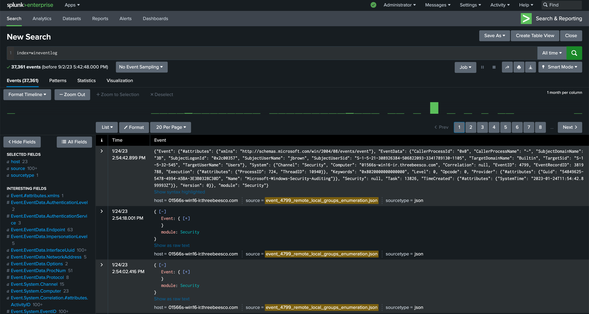
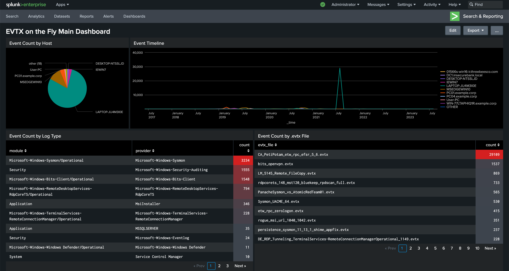

# splunk-evtx-onthefly
Deploy a Splunk, convert EVTXs, send Splunk in 2 minutes.

*Note: It depends on your connection speed :)*

*Note 2: If you are using Apple Silicon processors (M1, M2), unfortunetaly you cannot use this repo because Splunk's docker image does not support M1-M2.*

### Usage

*It requires docker compose installation.*

1. Put your evtx files into "evtx_files" directory.
2. Run `docker compose up` in the main directory.

It will download some images from Docker Hub and deploy a Splunk environment that already contains evtx logs.

To reach Splunk, go to http://localhost:8000

Username: admin

Password: evtxonthefly

Data can be searched by using ``index=wineventlog``.

The Splunk also contains a main dashboard that shows some data about your evtx files.

#### To destroy environment

Stop docker compose by pressing CTRL + C.